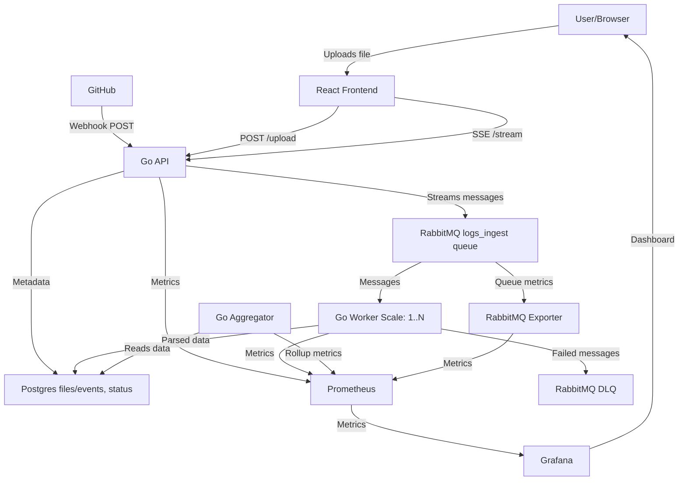

# Realtime Log Pipeline

_Created by an LLM_

A scalable, real-time log processing and monitoring pipeline built with Go, React, and modern observability tools. This system handles file uploads, GitHub webhook processing, and provides real-time streaming with comprehensive metrics and monitoring.

## 🏗️ Architecture Overview



## 🚀 Services Overview

### Frontend Services

- **React App** (Port 8080) - File upload interface with real-time streaming via Server-Sent Events (SSE)
- **Grafana** (Port 3000) - Monitoring dashboards and observability interface

### Backend Services

- **API Service** (Port 8081) - Main HTTP API handling uploads, GitHub webhooks, and SSE streaming
- **Worker Service** (Port 8082) - Scalable message processor for log parsing and data transformation
- **Aggregator Service** (Port 8083) - Data aggregation and rollup metrics generation
- **streamer Service** (Port 8084) - GitHub webhook handler and external data polling

### Infrastructure Services

- **PostgreSQL** (Port 5432) - Primary database for files, events, and status tracking
- **RabbitMQ** (Port 5672/15672) - Message broker with logs_ingest queue and Dead Letter Queue (DLQ)
- **Prometheus** (Port 9090) - Metrics collection and monitoring
- **RabbitMQ Exporter** - Queue metrics for monitoring

## 🛠️ Development Setup

### Quick Start (Recommended)

```bash
# 1. Start infrastructure services in containers
docker-compose -f docker-compose.dev.yml up -d

# 2. Run application services locally with hot-reload
just dev_all

# Access services:
# - React App: http://localhost:8080
# - API: http://localhost:8081
# - Grafana: http://localhost:3000 (admin/admin)
# - RabbitMQ Management: http://localhost:15672 (guest/guest)
```

### Alternative: Containerized Development

```bash
# Run specific services in containers for build consistency
./scripts/with_build.sh api        # API service
./scripts/with_build.sh worker     # Worker service
./scripts/with_build.sh all        # All Go services
```

### Individual Service Development

```bash
# Run services individually with hot-reload
just dev_api                       # API service only
just dev_worker                    # Worker service only
just dev_aggregator               # Aggregator service only
just dev_streamer                   # streamer service only
just dev_app                      # React app only
```

## 🚀 Production Deployment

```bash
# Deploy full production stack
docker-compose -f deploy/docker-compose.yml up -d

# Scale workers based on load
docker-compose -f deploy/docker-compose.yml up --scale worker=5 -d
```

## 📊 Data Flow

1. **File Upload**: Users upload files via React frontend
2. **GitHub Integration**: Webhooks trigger processing via API service
3. **Message Queuing**: API streams events to RabbitMQ logs_ingest queue
4. **Data Processing**: Scalable workers process messages and parse log data
5. **Error Handling**: Failed messages route to Dead Letter Queue for retry/analysis
6. **Data Storage**: Processed data and metadata stored in PostgreSQL
7. **Metrics Collection**: All services emit metrics to Prometheus
8. **Real-time Updates**: Frontend receives real-time updates via Server-Sent Events
9. **Observability**: Grafana dashboards provide comprehensive monitoring

## 🔧 Configuration

### Environment Variables

- Database: `PSQL_ADDR`, `PSQL_PORT`, `PSQL_USER`, `PSQL_PASS`, `PSQL_DB`
- Message Queue: `RABBITMQ_URL`
- Services: Individual port and configuration settings

### Configuration Files

- **Backend**: `backend/configs/*.yaml` - Service-specific configurations
- **Frontend**: `app/config.js` - Frontend application settings
- **Monitoring**: `deploy/prometheus/` and `deploy/grafana/` - Observability setup

## 📈 Monitoring & Observability

- **Metrics**: Prometheus scrapes all services for performance and health metrics
- **Dashboards**: Pre-configured Grafana dashboards for system monitoring
- **Health Checks**: All services include health endpoints for container orchestration
- **Queue Monitoring**: RabbitMQ management interface and Prometheus integration
- **Real-time Streaming**: Live updates through Server-Sent Events

## 🔄 Scaling

- **Horizontal Scaling**: Worker services can be scaled independently
- **Queue-based Architecture**: RabbitMQ handles load distribution and backpressure
- **Database Connection Pooling**: Configurable connection limits per service
- **Container Orchestration**: Ready for Docker Swarm or Kubernetes deployment

## 🧪 Development Tools

- **Hot Reload**: Air-powered development with automatic rebuilds
- **Code Quality**: ESLint, Prettier, golangci-lint, revive
- **Task Runner**: Just for development workflows
- **Build System**: Make for production builds
- **Container Development**: Full Docker development environment

## 📚 API Endpoints

- `POST /upload` - File upload handling
- `GET /stream` - Server-Sent Events for real-time updates
- `POST /webhook/github` - GitHub webhook processing
- `GET /metrics` - Prometheus metrics endpoint
- `GET /health` - Service health checks

---

_This project demonstrates modern cloud-native architecture with real-time processing, comprehensive monitoring, and scalable microservices design._

