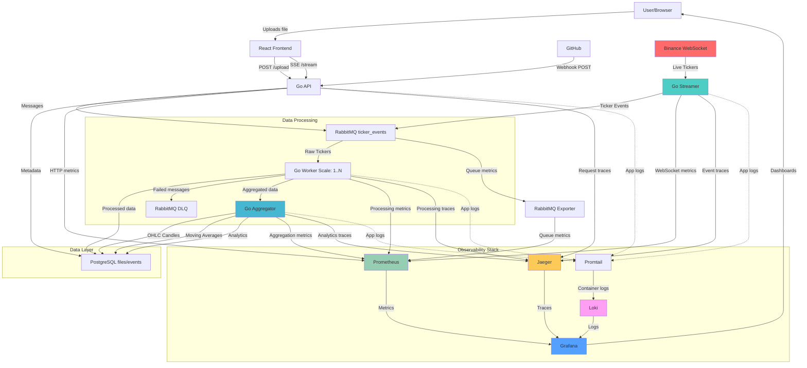

# Realtime Log Pipeline

_Created by an LLM_

A scalable, real-time financial data processing and monitoring pipeline built with Go, React, and comprehensive observability stack. This system handles cryptocurrency ticker data streaming from Binance, file uploads, GitHub webhook processing, and provides real-time data flow with complete metrics, tracing, and logging.

## 🏗️ Architecture Overview



## 🚀 Services Overview

### Frontend Services

- **React App** (Port 8080) - File upload interface with real-time streaming via Server-Sent Events (SSE)
- **Grafana** (Port 3000) - Unified observability dashboard for metrics, traces, and logs

### Backend Services

- **API Service** (Port 8081) - Main HTTP API handling uploads, GitHub webhooks, and SSE streaming
- **Worker Service** (Port 8082) - Scalable message processor for ticker data parsing and transformation
- **Aggregator Service** (Port 8083) - Real-time data aggregation, OHLC candle generation, and analytics
- **Streamer Service** (Port 8084) - Binance WebSocket handler for live cryptocurrency ticker data

### Infrastructure Services

- **PostgreSQL** (Port 5432) - Primary database for files, events, processed data, and aggregated analytics
- **RabbitMQ** (Port 5672/15672) - Message broker with topic exchanges for ticker events and Dead Letter Queue (DLQ)

### Observability Stack

- **Prometheus** (Port 9090) - Time-series metrics collection and alerting
- **Jaeger** (Port 16686) - Distributed tracing for request flow analysis
- **Loki** (Port 3100) - Log aggregation and querying
- **Promtail** - Log collection agent for container logs with smart filtering
- **Grafana** (Port 3000) - Unified dashboards for metrics, traces, and logs

## 🛠️ Development Setup

### Quick Start (Recommended)

```bash
# 1. Start infrastructure and observability services in containers
docker-compose -f docker-compose.dev.yml up -d

# 2. Run application services locally with hot-reload
just dev_all

# Access services:
# - React App: http://localhost:8080
# - API: http://localhost:8081
# - Grafana: http://localhost:3000 (admin/admin)
# - RabbitMQ Management: http://localhost:15672 (guest/guest)
# - Prometheus: http://localhost:9090
# - Jaeger UI: http://localhost:16686
```

### Alternative: Containerized Development

```bash
# Run specific services in containers for build consistency
./scripts/with_build.sh api        # API service
./scripts/with_build.sh worker     # Worker service
./scripts/with_build.sh all        # All Go services
```

### Individual Service Development

```bash
# Run services individually with hot-reload
just dev_api                       # API service only
just dev_worker                    # Worker service only
just dev_aggregator               # Aggregator service only
just dev_streamer                   # Streamer service only
just dev_app                      # React app only
```

## 🚀 Production Deployment

```bash
# Deploy full production stack with observability
docker-compose -f deploy/docker-compose.yml up -d

# Scale workers based on load
docker-compose -f deploy/docker-compose.yml up --scale worker=5 -d
```

## 📊 Data Flow

### Real-Time Ticker Processing

1. **External Data**: Binance WebSocket streams live ticker data (BTC, ETH, XRP)
2. **Data Ingestion**: Streamer service receives and validates ticker events
3. **Message Distribution**: Events published to RabbitMQ topic exchange with routing keys
4. **Parallel Processing**: Multiple workers consume and process ticker data
5. **Data Aggregation**: Aggregator generates OHLC candles, moving averages, and analytics
6. **Storage**: Raw and aggregated data stored in PostgreSQL with proper indexing
7. **Real-time Updates**: Frontend receives live updates via WebSocket/SSE

### File Upload & GitHub Integration

1. **File Upload**: Users upload files via React frontend
2. **GitHub Integration**: Webhooks trigger processing via API service
3. **Message Queuing**: Events streamed to RabbitMQ for asynchronous processing
4. **Error Handling**: Failed messages route to Dead Letter Queue for retry/analysis

### Observability & Monitoring

1. **Metrics Collection**: All services emit custom and system metrics to Prometheus
2. **Distributed Tracing**: Request flows tracked end-to-end with OpenTelemetry and Jaeger
3. **Log Aggregation**: Promtail collects container logs and ships to Loki with smart filtering
4. **Unified Dashboards**: Grafana provides correlation between metrics, traces, and logs
5. **Alerting**: Prometheus AlertManager for proactive monitoring

## 🔧 Configuration

### Environment Variables

- Database: `PSQL_ADDR`, `PSQL_PORT`, `PSQL_USER`, `PSQL_PASS`, `PSQL_DB`
- Message Queue: `RABBITMQ_URL`
- Services: Individual port and configuration settings
- Observability: Trace endpoints, metrics ports, log levels

### Configuration Files

- **Backend**: `backend/configs/*.yaml` - Service-specific configurations
- **Frontend**: `app/config.js` - Frontend application settings
- **Monitoring**: `deploy/prometheus/` and `deploy/grafana/` - Observability setup
- **Log Collection**: `deploy/promtail/` - Log pipeline configuration

## 📈 Observability Features

### Metrics Dashboard

- **System Metrics**: CPU, memory, disk usage across all services
- **Application Metrics**: Request rates, response times, error rates
- **Business Metrics**: Ticker processing rates, WebSocket connection health
- **Queue Metrics**: Message rates, queue depths, processing latency

### Distributed Tracing

- **End-to-End Visibility**: Track requests from Binance → Database
- **Performance Analysis**: Identify bottlenecks and optimization opportunities
- **Error Investigation**: Trace failed requests across service boundaries
- **Dependency Mapping**: Visualize service interactions and data flow

### Centralized Logging

- **Structured Logs**: JSON format with trace correlation
- **Smart Filtering**: Application logs separated from infrastructure logs
- **Query Interface**: Grafana-integrated log exploration
- **Retention Policies**: Different retention for application vs infrastructure logs

## 🔄 Data Pipeline Features

### Real-Time Analytics

- **OHLC Candles**: 1m, 5m, 15m, 1h, 4h, 1d timeframes
- **Technical Indicators**: Moving averages (SMA, EMA), RSI, MACD
- **Volume Analysis**: Volume-weighted average price (VWAP)
- **Cross-Symbol Correlation**: BTC/ETH/XRP relationship analysis

### Scaling Capabilities

- **Horizontal Scaling**: Worker services scale independently based on queue depth
- **Load Distribution**: RabbitMQ handles backpressure and load balancing
- **Database Optimization**: Connection pooling and query optimization
- **Container Orchestration**: Ready for Kubernetes deployment

## 🧪 Development Tools

- **Hot Reload**: Air-powered development with automatic rebuilds
- **Code Quality**: ESLint, Prettier, golangci-lint, revive
- **Task Runner**: Just for development workflows
- **Build System**: Make for production builds
- **Container Development**: Full Docker development environment
- **Observability Testing**: Local stack mirrors production monitoring

## 📚 API Endpoints

### Application APIs

- `POST /upload` - File upload handling
- `GET /stream` - Server-Sent Events for real-time updates
- `POST /webhook/github` - GitHub webhook processing
- `GET /health` - Service health checks

### Observability APIs

- `GET /metrics` - Prometheus metrics endpoint (all services)
- `GET /trace` - Jaeger trace collection
- `POST /loki/api/v1/push` - Log ingestion endpoint

## 💡 Key Features

### Financial Data Processing

- **Real-time ticker ingestion** from Binance WebSocket
- **High-frequency data aggregation** (1000+ events/second)
- **Financial indicators calculation** with sub-second latency
- **Multi-symbol correlation analysis**

### Production-Ready Observability

- **Three pillars of observability**: Metrics, traces, logs
- **Correlation across data types** with trace IDs
- **Performance monitoring** at scale
- **Proactive alerting** and anomaly detection

### Microservices Architecture

- **Event-driven design** with message queues
- **Service isolation** with independent scaling
- **Fault tolerance** with circuit breakers and retries
- **API gateway patterns** for external interfaces

---

_This project demonstrates modern cloud-native architecture with real-time financial data processing, comprehensive observability, and scalable microservices design. Perfect for high-frequency trading platforms, cryptocurrency analytics, or any real-time data processing pipeline._

## TODOS

🔒 Dedicated metrics ports (9001-9004) - Internal network only
🔐 Authentication required for metrics access
🛡️ Network segmentation - Observability isolated from public traffic
🎯 Clear separation of concerns
