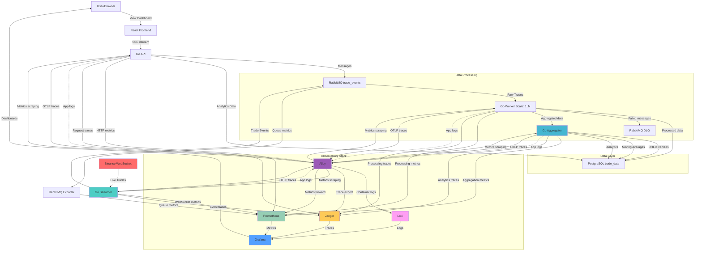
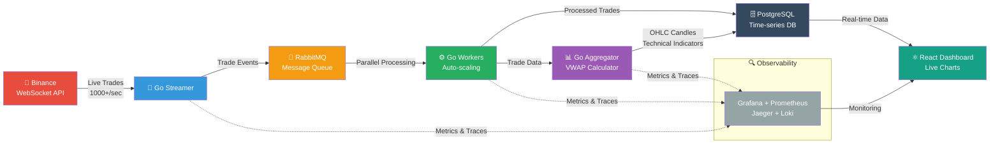

# Realtime Log Pipeline

_Created by an LLM_

A scalable, real-time financial data processing and monitoring pipeline built with Go, React, and comprehensive observability stack. This system handles cryptocurrency trade data streaming from Binance WebSocket API and provides real-time VWAP calculations, OHLC candle generation, and technical analysis with complete metrics, tracing, and logging.

## 🏗️ Architecture Overview

### Complete Architecture



### Simplified Architecture (LinkedIn)



## 🚀 Services Overview

### Frontend Services

- **React App** (Port 8080) - Real-time trading dashboard with live charts and analytics via Server-Sent Events (SSE)
- **Grafana** (Port 3000) - Unified observability dashboard for metrics, traces, and logs

### Backend Services

- **API Service** (Port 8081) - Main HTTP API serving trading data endpoints and SSE streaming for real-time updates
- **Worker Service** (Port 8082) - Scalable message processor for trade data parsing, VWAP calculation, and transformation
- **Aggregator Service** (Port 8083) - Real-time trade data aggregation, OHLC candle generation from executed trades, and financial analytics
- **Streamer Service** (Port 8084) - Binance WebSocket handler for live cryptocurrency trade execution data

### Infrastructure Services

- **PostgreSQL** (Port 5432) - Primary time-series database for trade data, OHLC candles, and aggregated financial analytics
- **RabbitMQ** (Ports 5672/15672/15692) - Message broker with topic exchanges, management UI, and Prometheus metrics

### Observability Stack

- **Prometheus** (Port 9090) - Time-series metrics collection and alerting
- **Jaeger** (Port 16686) - Distributed tracing for request flow analysis
- **Loki** (Port 3100) - Log aggregation and querying
- **Alloy** (Ports 12345, 4317, 4318) - Grafana Agent for telemetry collection (metrics, logs, traces)
- **Grafana** (Port 3000) - Unified dashboards for metrics, traces, and logs

## 🛠️ Development Setup

### Quick Start (Recommended)

```bash
# 1. Start infrastructure and observability services in containers
docker-compose -f docker-compose.dev.yml up -d

# 2. Run application services locally with hot-reload
just dev_all

# Access services:
# - React App: http://localhost:8080
# - API: http://localhost:8081
# - Grafana: http://localhost:3000 (user/pass)
# - RabbitMQ Management: http://localhost:15672 (user/pass)
# - Prometheus: http://localhost:9090
# - Jaeger UI: http://localhost:16686
# - Alloy UI: http://localhost:12345
```

### Alternative: Containerized Development

```bash
# Run specific services in containers for build consistency
./scripts/with_build.sh api        # API service
./scripts/with_build.sh worker     # Worker service
./scripts/with_build.sh all        # All Go services
```

### Individual Service Development

```bash
# Run services individually with hot-reload
just dev_api                       # API service only
just dev_worker                    # Worker service only
just dev_aggregator               # Aggregator service only
just dev_streamer                   # Streamer service only
just dev_app                      # React app only
```

## 🚀 Production Deployment

```bash
# Deploy full production stack with observability
docker-compose -f deploy/docker-compose.yml up -d

# Scale workers based on load
docker-compose -f deploy/docker-compose.yml up --scale worker=5 -d
```

## 📊 Data Flow

### Real-Time Trade Processing

1. **External Data**: Binance WebSocket streams live trade execution data (BTC, ETH, XRP)
2. **Data Ingestion**: Streamer service receives and validates individual trade events
3. **Message Distribution**: Trade events published to RabbitMQ topic exchange with routing keys
4. **Parallel Processing**: Multiple workers consume and process actual executed trades
5. **Data Aggregation**: Aggregator generates OHLC candles from real trade prices, calculates VWAP, and analytics
6. **Storage**: Raw trade data and aggregated results stored in PostgreSQL with time-series indexing
7. **Real-time Updates**: Frontend receives live trade updates and aggregated metrics via WebSocket/SSE

### Real-Time Dashboard & Monitoring

1. **Live Dashboard**: React frontend displays real-time trading data and analytics
2. **Server-Sent Events**: API service streams live updates to connected clients
3. **Data Visualization**: Interactive charts showing OHLC candles, VWAP trends, and technical indicators
4. **Error Handling**: Failed trade processing routes to Dead Letter Queue for retry/analysis

### Observability & Monitoring

1. **Metrics Collection**: Alloy scrapes metrics from all services and forwards to Prometheus
2. **Distributed Tracing**: Services send OTLP traces to Alloy, which exports to Jaeger
3. **Log Aggregation**: Alloy collects container logs with structured parsing and ships to Loki
4. **Unified Observability**: Alloy acts as central telemetry collector for all three pillars
5. **Unified Dashboards**: Grafana provides correlation between metrics, traces, and logs with pre-configured datasources
6. **Alerting**: Prometheus AlertManager for proactive monitoring

## 🔧 Configuration

### Environment Variables

- Database: `PSQL_ADDR`, `PSQL_PORT`, `PSQL_USER`, `PSQL_PASS`, `PSQL_DB`
- Message Queue: `RABBITMQ_URL`
- Services: Individual port and configuration settings
- Observability: Trace endpoints, metrics ports, log levels

### Configuration Files

- **Backend**: `backend/configs/*.yaml` - Service-specific configurations
- **Frontend**: `app/config.js` - Frontend application settings
- **Observability Stack**:
  - `deploy/alloy/config.alloy` - Grafana Alloy telemetry collection configuration
  - `deploy/prometheus/prometheus.yml` - Prometheus scraping configuration
  - `deploy/grafana/provisioning/` - Grafana dashboards and datasource provisioning
- **Message Queue**: `deploy/rabbitmq/enabled_plugins` - RabbitMQ plugin configuration

## 📈 Observability Features

### Metrics Dashboard

- **System Metrics**: CPU, memory, disk usage across all services
- **Application Metrics**: Request rates, response times, error rates
- **Business Metrics**: Trade processing rates, execution volume, WebSocket connection health, VWAP accuracy
- **Queue Metrics**: Message rates, queue depths, processing latency via RabbitMQ Prometheus plugin (port 15692)
- **Telemetry Collection**: Alloy provides unified collection of metrics, logs, and traces

### Distributed Tracing

- **OpenTelemetry Protocol**: Services send traces via OTLP (gRPC 4317, HTTP 4318) to Alloy
- **End-to-End Visibility**: Track trade events from Binance → Database with automatic span correlation
- **Performance Analysis**: Identify bottlenecks and optimization opportunities
- **Error Investigation**: Trace failed requests across service boundaries with trace-log correlation
- **Dependency Mapping**: Visualize service interactions and data flow
- **Batch Processing**: Optimized trace batching (8192 spans, 10s timeout) for high-throughput scenarios

### Centralized Logging

- **Structured Logs**: JSON format with trace correlation via Alloy processing
- **Smart Filtering**: Application and infrastructure logs separated with different processing pipelines
- **Auto-Discovery**: Alloy automatically discovers and processes Docker container logs
- **Trace Correlation**: Logs automatically correlated with traces using trace_id extraction
- **Query Interface**: Grafana-integrated log exploration with Loki datasource
- **Retention Policies**: Different retention for application vs infrastructure logs

## 🔄 Data Pipeline Features

### Real-Time Analytics

- **OHLC Candles**: 1m, 5m, 15m, 1h, 4h, 1d timeframes from actual executed trades
- **Volume-Weighted Pricing**: VWAP and TWAP calculations using real trade volumes
- **Technical Indicators**: Moving averages (SMA, EMA), RSI, MACD based on execution prices
- **Market Microstructure**: Buy/sell pressure analysis, trade size distribution
- **Cross-Symbol Correlation**: BTC/ETH/XRP relationship analysis using actual market activity

### Scaling Capabilities

- **Horizontal Scaling**: Worker services scale independently based on queue depth
- **Load Distribution**: RabbitMQ handles backpressure and load balancing
- **Database Optimization**: Connection pooling and query optimization
- **Container Orchestration**: Ready for Kubernetes deployment

## 🧪 Development Tools

- **Hot Reload**: Air-powered development with automatic rebuilds
- **Code Quality**: ESLint, Prettier, golangci-lint, revive
- **Task Runner**: Just for development workflows
- **Build System**: Make for production builds
- **Container Development**: Full Docker development environment
- **Observability Testing**: Local stack mirrors production monitoring with Alloy
- **Telemetry Debugging**: Alloy UI (port 12345) for pipeline monitoring and debugging

## 📦 Service Versions (docker-compose.dev.yml)

- **PostgreSQL**: 17.6
- **RabbitMQ**: 4.1.3-management (with Prometheus plugin)
- **Prometheus**: v3.5.0
- **Grafana**: 11.5 (with enhanced plugins)
- **Grafana Alloy**: v1.10.0
- **Loki**: 2.9.0
- **Jaeger**: 1.55 (all-in-one with OTLP support)

## 📚 API Endpoints

### Application APIs

- `GET /stream` - Server-Sent Events for real-time trade data and analytics
- `GET /api/candles/{symbol}` - OHLC candle data for specific cryptocurrency
- `GET /api/vwap/{symbol}` - Volume-weighted average price calculations
- `GET /health` - Service health checks

### Observability APIs

- `GET /metrics` - Prometheus metrics endpoint (all services)
- `GET /trace` - Jaeger trace collection
- `POST /loki/api/v1/push` - Log ingestion endpoint

## 💡 Key Features

### Financial Data Processing

- **Real-time trade execution ingestion** from Binance WebSocket API
- **High-frequency trade aggregation** with actual market volumes and prices
- **VWAP/TWAP calculation** using time and volume weighting from executed trades
- **Financial indicators calculation** based on real market activity with sub-second latency
- **Multi-symbol correlation analysis** using actual trade flow patterns

### Production-Ready Observability

- **Unified telemetry collection** via Grafana Alloy
- **Three pillars of observability**: Metrics, traces, logs with automatic correlation
- **OpenTelemetry standard** for trace collection and export
- **Auto-discovery** of containerized services
- **Performance monitoring** at scale with optimized batching
- **Proactive alerting** and anomaly detection

### Microservices Architecture

- **Event-driven design** with message queues
- **Service isolation** with independent scaling
- **Fault tolerance** with circuit breakers and retries
- **API gateway patterns** for external interfaces

---

_This project demonstrates modern cloud-native architecture with real-time financial data processing, comprehensive observability, and scalable microservices design. Perfect for high-frequency trading platforms, cryptocurrency analytics, or any real-time data processing pipeline._

## TODOS

🔒 Dedicated metrics ports (9001-9004) - Internal network only
🔐 Authentication required for metrics access
🛡️ Network segmentation - Observability isolated from public traffic
🎯 Clear separation of concerns
